```mermaid
graph TD
    A[🌱 Currently Learning] --> B[React Advanced Patterns]
    A --> C[Next.js 14 Features]
    A --> D[React Native Expo]
    A --> E[DevOps & CI/CD]
    
    F[💡 Working On] --> G[Glide Platform]
    F --> H[Personal Portfolio]
    F --> I[Open Source Contributions]
    
    J[🎯 Goals 2025] --> K[Master React Native]
    J --> L[Cloud Architecture]
    J --> M[Tech Leadership]
```

#  Hey there! I'm Craftzmen

<div align="center">
  
</div>

---

##  About Me

```javascript
const craftzmen = {
    pronouns: "He/Him",
    location: "Building the future, one component at a time",
    currentFocus: ["React", "Next.js", "React Native", "DevOps"],
    interests: ["JavaScript Frameworks", "Modern Web Development", "Mobile Apps"],
    motto: "Code with passion, build with purpose",
    funFact: "I turn coffee into code ☕ → 💻"
};
```

---

##  Tech Stack

### Frontend
    

### Styling
  

### Backend & Database
   

### DevOps & Tools
   

---

##  Featured Project

### 🚀 **Glide** - All-in-one Content & Learning Environment
> *Transforming how we learn and create content*

<div align="center">
  <a href="https://craftzmen.vercel.app">
    
  </a>
  
  
</div>

**✨ Features:**
- 📚 Interactive learning modules
- 🎨 Content creation tools
- 🔄 Real-time collaboration
- 📱 Responsive design
- ⚡ Lightning-fast performance

---

##  GitHub Stats

<div align="center">
  
  
</div>

<div align="center">
  
</div>

---

##  What I'm Up To



---

##  Let's Connect!

<div align="center">
  
**Looking to collaborate on React/Next.js projects?** <br/>
**Let's build something amazing together!** 🚀

<a href="https://craftzmen.vercel.app">
  
</a>
<a href="mailto:abdullah.imran.code@gmail.com">
  
</a>
<a href="https://linkedin.com/in/craftzmen">
  
</a>
<a href="https://x.com/@Craftzmen">
  
</a>

</div>

---

##  Quick Facts


- 🔭 **Currently working on:** Next.js applications and React Native mobile apps
- 🌱 **Learning:** Advanced React patterns, DevOps, and cloud architecture
- 👯 **Open to collaborate on:** React/Next.js projects, open-source contributions
- 🤔 **Ask me about:** JavaScript, React ecosystem, web performance
- ⚡ **Fun fact:** I debug faster with music on! 🎵
- 🎯 **Mission:** Making web development accessible and enjoyable for everyone

---

<div align="center">
  
###  Thanks for visiting! 
  


**"Code is like humor. When you have to explain it, it's bad."** - Cory House

</div>

---

<div align="center">
  
  <br/>
  <sub>Made with ❤️ by <a href="https://github.com/Craftzmen">Craftzmen</a></sub>
</div>
